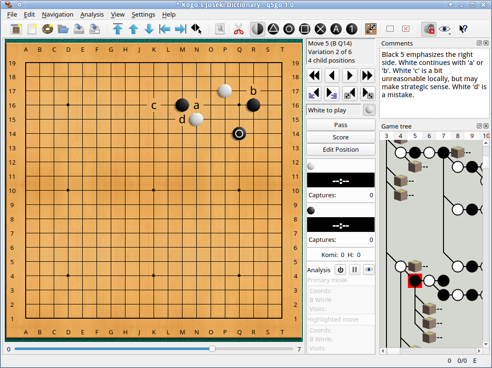
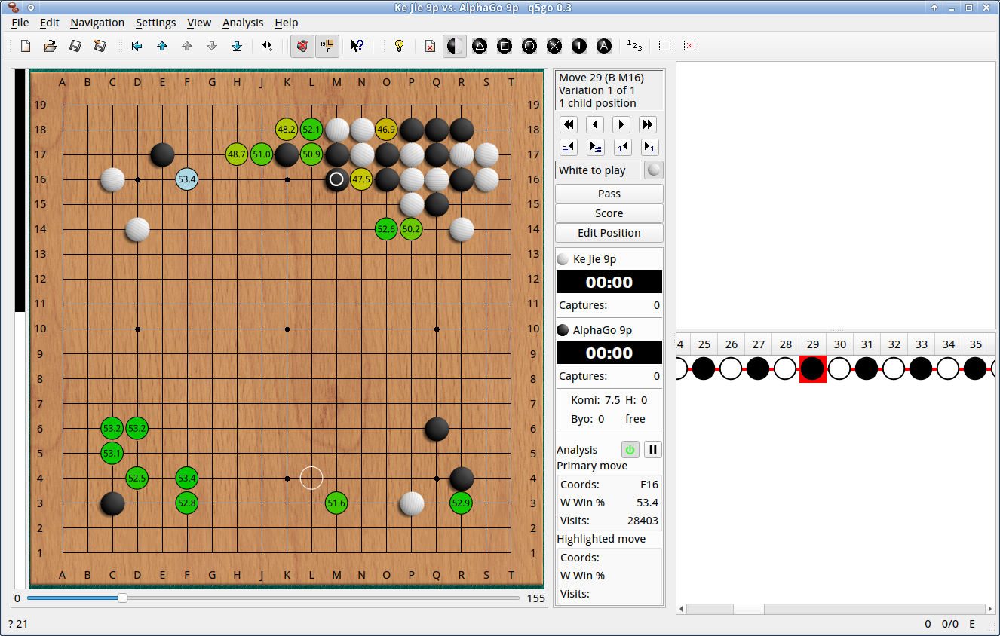
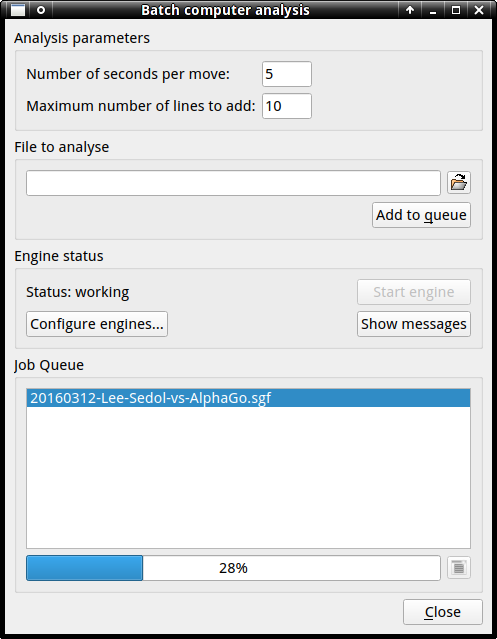
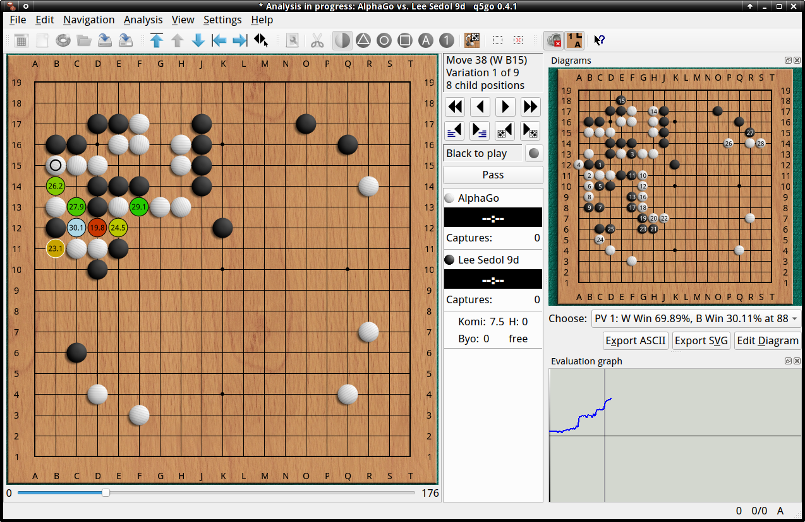
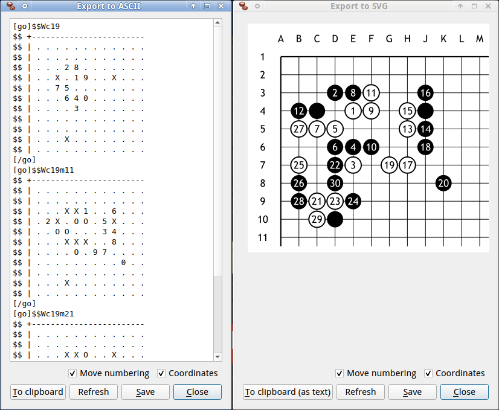
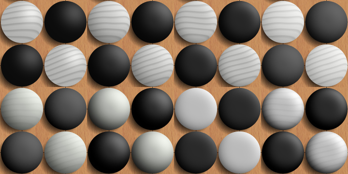
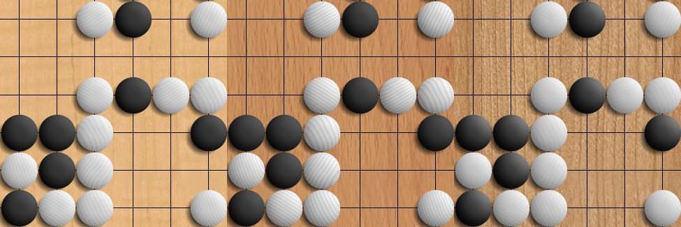
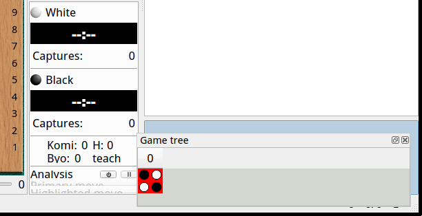
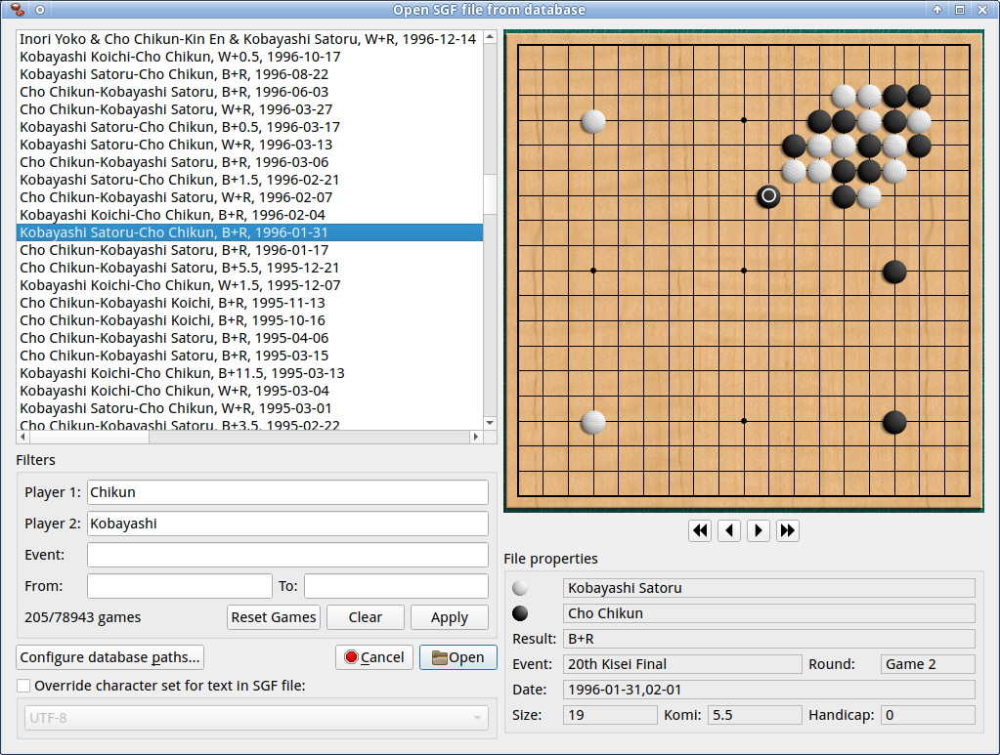
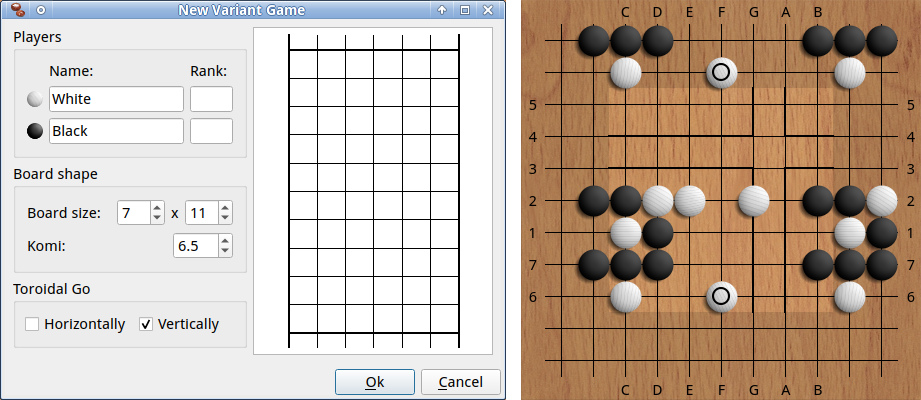

## q5Go 0.7

This is a tool for Go players which performs the following functions:
- SGF editor
- Analysis frontend for Leela Zero (or compatible engines)
- GTP interface
- IGS client

The basic goal for this program is to provide an everyday SGF editor
that is fast, easy and convenient to use and does everything you could
want out of such a tool.  Some of the more unusual features include a
Go diagram exporting function for sites like lifein19x19.com or
Sensei's library, as well as SVG vector graphics export.  q5go also supports
some non-standard Go variants.

This program is based on the old Qt3 version of qGo, but ported to Qt5
and modernized.



These are major user-visible changes in 0.7:
 * Old SGFs and a few new ones use a move at 20:20 to signal pass which
   caused problems when loading such SGFs.
 * q5go can now read kombilo databases.  There is a new file open dialog
   to select a game from the database; it has preview functionality to
   display game information and allow browsing through the game moves.
 * Visibility of menu, status bar, side bar and slider in the board
   window are now saved as part of the layout.  Whatever preferences
   option there were have been removed, except for the one to choose
   whether to place the side bar to the left or the right.

See VERSION_HISTORY for a history of changes.

## Overview of features

### Analysis mode
q5Go supports not only play against AI engines, but can also connect to
Leela Zero to use it as an an analysis tool, displaying statistics such
as win-rates and visit counts, and displaying variations.  This is
available both for local SGF editing, and for observing on-line games.
By middle-clicking or shift-clicking on a displayed variation, it can
be added to the game record.



There is also a batch analysis mode, where the use can queue a number of
SGF files for analysis. Evaluations and variations are added automatically,
the variations are presented as diagrams.  The file can be observed
during analysis.




### Export
q5Go allows the user to export board positions as ASCII diagrams suitable
for Sensei's Library or the lifein19x19.com forums, or in the SVG vector
graphics format which should be suitable for printing.  In both cases,
the user can select a sub-area of the board to be shown in the export,
and it is possible to set a position as the start of move numbering, so
that sequences of moves can be shown in the exported diagram.



### SGF diagrams

It is possible to set a game position as the start of a diagram.  This is
has several use cases:
- Subdividing a game record into printable diagrams.  Figures can be
  exported to ASCII and SVG, in whole or in part, just like regular
  board positions.
- Allowing variations to be shown in a separate board display
- Neatly organizing engine lines when performing an analysis

### Configurable appearance

The look of the board and stones can be configured to suit the user's
personal taste.  The stones are generated in a shaded 3D look, and both
the shape and the lighting can be changed.



There are several presets for the wood image, and the user can also
supply a custom file.



### Configurable user interface layout

All optional elements of the board window reside in freely moveable and
resizable docks, giving the user flexibility to create exactly the layout
they want.  These layouts can be saved and restored, and the program
tries to restore the correct layout whenever a new window is opened.



### Database support

q5go can access a Kombilo database and search it by player name or
game event or date. This functions as an alternative file open dialog
with preview functionality.



### Go variants

q5go supports rectangular and toroidal boards.  Note that the latter
can only be saved in a non-standard SGF format since the specification
does not allow for it.  When playing on a torus, q5go can be configured
to extend the board past its regular dimensions, duplicating parts of
the position for a better overview.  Also, the board can be dragged
with the middle mouse button.



The screenshot shows the variant game dialog and a (different) position
with both axes set to be toroidal.

## Compiling

On Linux, make a build subdirectory, enter it, and run
```sh
  qmake ../src/q5go.pro PREFIX=/where/you/want/to/install
```
followed by make and make install.  If the pandoc tool is installed, this
README.md file will be converted to html and installed, and can then be
viewed through a menu option.

On Windows, download the Qt tools and import the q5go.pro project file
into Qt Creator.
