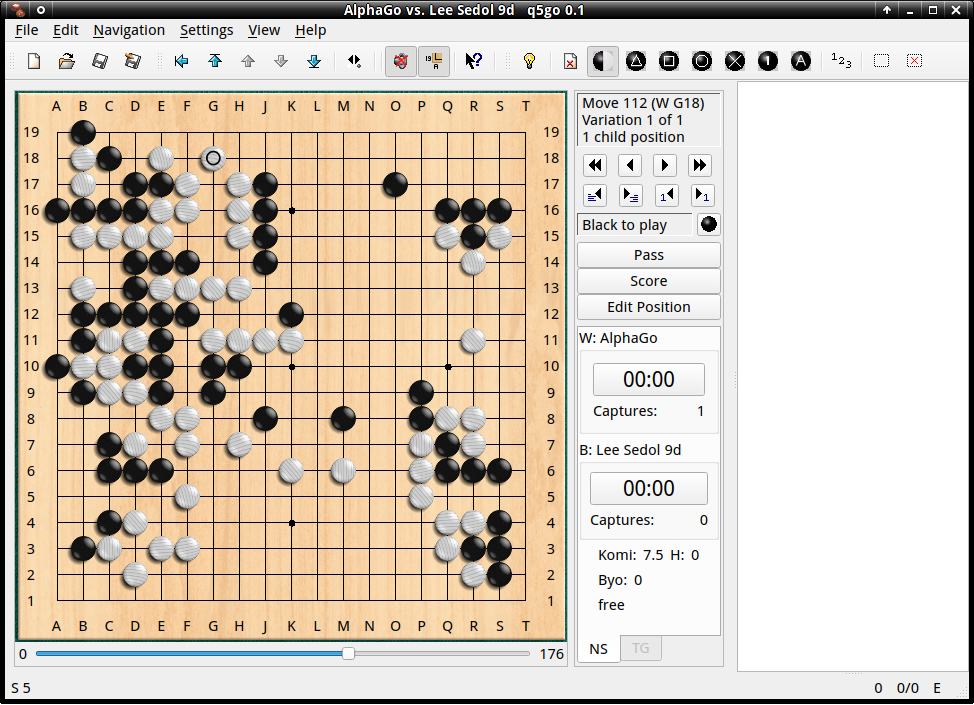

## q5Go 0.2

This is a Go player's tool, an SGF editor/GTP interface/IGS client.  It is
based on the old Qt3 version of qGo, but ported to Qt5 and modernized.

The basic goal for this program is to provide an everyday SGF editor that
is fast, easy and convenient to use and does everything you could want out
of such a tool.



Version 0.2 is mostly a maintenance release which fixes some issues in 0.1.
 * Fixed a rare crash that occurred when observing an IGS game just as it
   ended.
 * Fixed GTP support to also work on Windows - there were some portability
   issues with the underlying Qt toolkit.
 * Added support for configuring multiple GTP engines like GnuGo or Leela.
 * Allow loading certain types of invalid SGF files that occur in the wild.

See VERSION_HISTORY for a history of changes.

## Compiling

Make a build subdirectory, enter it, and either run
```sh
  ../configure
```
or
```sh
  qmake ../src/q5go.pro
```

followed by make.  The latter is probably recommended as the automake system
is somewhat cobbled-together.
